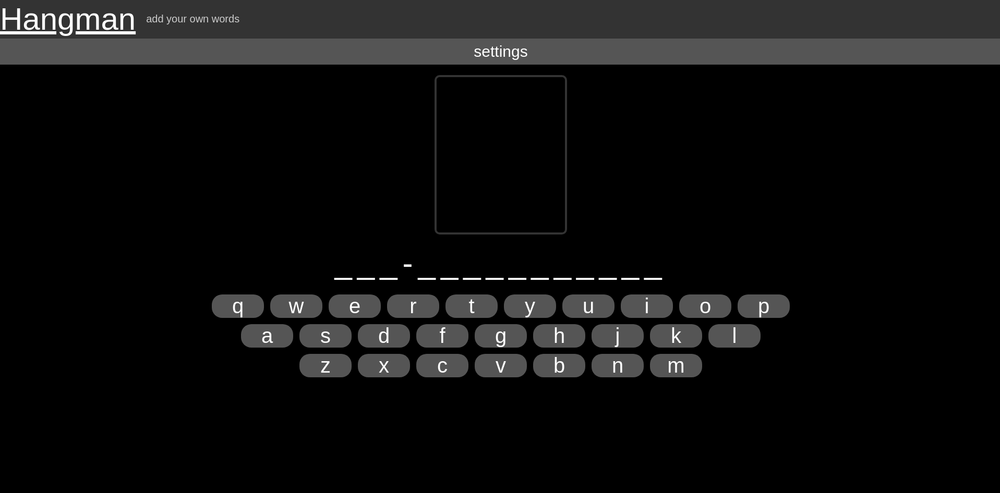

# hangman
## intro
This is a hangman web app built with node.js using the express framework and SQLite. It can be easily set up, includes multiple features, and has lots of potential for more to be added.

Most importantly, it allows a user to play the standard game but also allows for these settings to be changed:
* A user can pick which word categories they want from pre-made lists (customizable in the [DB setup script](./migrations-sqlite/001-initial.sql)) and user-submitted words.
* how many lives are available, they can choose between 4/8/12 lives.
* if a hint is to be displayed after half the user's lives are used.

Another key feature of this site is the inclusion of "user-submitted words". This allows users to submit their own words and their hints to the database (before these words are added, it goes through a checking function that ensures it's a valid word). Players can then choose these words as a category in the settings menu.

This app is hosted at [hangman.tyway.net](http://hangman.tyway.net)
## Setup
1. ensure you have the latest version of Node and NPM installed
2. in terminal/cmd, go to the folder where the files are installed
3. run `npm i` to install the dependencies 
4. run `npm start` to run the site

This will start the HTTP server running on 8080, and it should work with no extra setup required.

If it worked, when you connect to the server (on a widescreen web browser), you should view this:

It should be noted that this setup works on any \*nix or windows environment, provided it can support the latest version of Node and NPM. 
## feature details
### web API
* `/word?categorys=a,b,c`
  * This is a GET request that returns a JSON object which looks like:
    * `{ word, underscore, def }`
  * it calls [this function](./lib/wordlib.mjs#L13)
  * This URL requires one parameter, which is `categorys`. This is a CSV list of possible categories and can only be from this list:
    * `random`
    * `movie`
    * `tvshow`
    * `user`
* `/addWord`
  * This is a POST request for adding a word to the database and, if successful, will return `OK`
  * it calls [this function](./lib/wordlib.mjs#L31)
  * it expects a JSON object that looks like:
    * `{ word, def }`
  * this object goes through checks to ensure the word and its hint are valid. These checks happen in [this function](./lib/checks.mjs#L3)
  * if the check fails, an error message is sent back, and the word is not added to the DB
* `/turn?undercores&wordID&letter`
  * This is a GET request with three needed queries:
    * `underscore` this is the current state of where the game is at where the underscores is the word with the letters replaced with underscores (except guessed letters).
    * `wordID` is the string that is the ID for the word that is in use
    * `letter` this is the guessed letter
  * This will return an object with the word id and the `userUnderscore` (this is the inputted underscores with the guessed letter in it or not). It looks like `{ wordID, userUnderscores }` 
### Database and word management
When the `npm start` is first run, the program will go through the [DB setup script](./migrations-sqlite/001-initial.sql) and database.sqlite will be created; this DB contains the words table with all the 49 pre-made words from the setup script. You can edit and add to this; however, you must have at least one word for each category. Each word needs an:
* ID (INT)
* a word (a string up to 45 char, must be unique. for the game to work it cannot contain symbols or numbers. Spaces are allowed)
* a hint/def (all characters allowed, must not be NULL)
* category (must be within the four categories of the game 'random' 'movie' 'tvshow' 'user', cannot be in more than one category)

When a word is requested through `/word` a word object is returned that looks like this: `{ id, underscore, def }`
* `id`
  * this is the id for the word, so when the user calls turn, the server knows which word is in use
  * An example would be: `13` which corresponds with `"the-it-crowd"` 
* `underscore`
  * this is the word exploded into an array, and its characters have been replaced with underscores. As the game goes on, these underscores are replaced with the guessed letters
  * spaces remain as dashes
  * An example would be: `["_", "_", "_", "-", "_", "_", "-", "_", "_", "_", "_", "_"]`
* `def`
  * this is the words hint and is just a string
  * An example would be: `" an IT team" `
### DOM layout and functions 
* nav bar
  * in [the HTML](./static/index.html#L11), there are two copies of the navbar, one for desktop and one for mobile. There is a CSS media query for the screen size when the page is loaded. If the screen size is below `600px` it will then hide the desktop navbar by changing `--nav-big-display: none;` and `--nav-small-display: flex;`. By default, it is the other way around.
  * only the small navbar uses JS and its functions are in [domlib.mjs](./static/lib/domlib.mjs#L1). All these do is add an eventlistner to the burger button; when activated, switch classes on the navbar to open and close the menu.
* settings overlay
  * The settings overlay is just a div that covers the whole page. When not applied, its display is set to none, but when the settings button is pressed, it runs [this toggle function](./static/lib/domlib.mjs#L18), which changes the display to either flex or none depending on the `toggle` parameter. Centred in that overlay is the settings element, a grid box split into four sections with their respective settings, except for the bottom-right element, the apply button.
* on-screen keyboard
  * The keyboard is made by the [createKeyboard function](./static/lib/domlib.mjs#L27). This function works by looping through an array, and the array contains the alphabet in the qwerty format and `nl` (newline) where there is to be a new line. It looks like this:
  * `['nl', 'q', 'w', 'e', 'r', 't', 'y', 'u', 'i', 'o', 'p', 'nl', 'a', 's', 'd', 'f', 'g', 'h', 'j', 'k', 'l', 'nl', 'z', 'x', 'c', 'v', 'b', 'n', 'm']`
  * When the item of the array is `nl` it creates a new line div and its styles and then appends it to the keyboard div. When it is just a normal letter, it creates its button adds the styles and content and then appends it to the current line that it is on. 
* Game updates
  * multiple functions handle DOM updates during the game; these are:
    * [updateDOM(lives, livesCounter, underscores, hint, wordDef)](./static/lib/domlib.mjs#L70)
      * This function updates the game's key components, and each parameter is the value it changes the element to. For example, it uses `lives - livesCounter` to select the appropriate state of the hangman
      * It should also be noted that `hint` is a boolean. If True and half the lives are used, it will display `wordDef`.
    * [updateLetter(correct, letter)](./static/lib/domlib.mjs#L58)
      * This is called whenever a guess is made. It updates the key to either be green or red. 
    * [deactivateKeyboard()](./static/lib/domlib.mjs#L50)
      * This is ran at the end of the game. It loops through the keyboard and checks if the letter has been guessed. If not, it disables the button.
    * [end(completeWord, win)](./static/lib/domlib.mjs#L85)
      * This function is ran at the end of the game. If `win = Flase` it then displays the underscores and colours it red. If `win = True` it colours it green
      * This function also reveals the replay button 
    * [noCategory()](./static/lib/domlib.mjs#L107)
      * This function displayes an error if no categorys are selected.
### game logic
* when the page loads it [sets up the page](./static/lib/hangman.mjs#L13). It makes the keyboard, adds the eventlisteners and runs the [reset function](./static/lib/hangman.mjs#L46), which cleans up the page and sets all the values then it runs [startGame](./static/lib/hangman.mjs#L63). This function gets the word from the server, and applies the settings and it runs [updateDOM](./static/lib/domlib.mjs#L70) and then its waiting for user input.
* When a key is pressed, it runs [turn(letter)](./static/lib/hangman.mjs#L88), which is the primary function in the games loop, and it runs in this sequence:
  * First, it checks if the letter has already been guessed. If so, it returns
  * It makes a copy of `word.underscore`. This is for later so we can check if a correct guess has been made as these two will differ
  * It then sends the id, underscores, and letter to the server through `/turn`
  * The server then loops through `word.word` and checks the inputted letter against each letter. If there's a match, it will replace the underscore of the exact location in `userUnderscore`. After it loops through, it sends `userUnderscore` back.
  * On the response the client replaces `word.underscore` with `returnWord.underscore`.
  * Then it checks if there is a difference between `OldUnderscore` and `word.underscore`. If there is a difference, the user guessed a correct letter, and that letter will be in `word.underscore`. No difference means there were no matches between the inputted `letter` and the letters in `word.word`, so it removes a life and colours the letter red. 
  * It then runs `updateDom()` to update the UI with new information (e.g. change the hangman picture).
  * The function then checks if the game has ended, it runs two checks. First, it checks if `word.underscore === word.word` if so, that means all the correct letters have been guessed, and the user has won. It also checks that the lives are above zero. If they're below zero, then the user has lost.
  * When the game finishes, either by winning or losing, `end()` is called.
### User-submitted words logic
* all the client-side functionality happens from [this page](./static/lib/addword.mjs) and it sends a post request to `/addword`
* When the user presses the submit button on the addword page, the [sendWord() function](./static/lib/addword.mjs#L11) grabs the content from the text fields and puts it into a payload object and then sends it to the server in a POST request.
* When the server gets the packet, it runs checks on it with the [addWordCheck function](./lib/checks.mjs#L3). These checks are:
  * If the word is already in the DB.
  * If the word is below three characters.
  * If the word is above eighteen characters.
  * If the word contains anything other than letters or spaces.
  * If the def is below five-hundred characters.
  * If the def is above one character.
  * If the word or def contains any bad words, defined in the [profanities.json file](./lib/profanities.json)
* If the payload object is valid `OK` is sent back, and the word is added to the DB. Then the `sendWord` function clears the text fields and turns the submit button green.
* If the payload object is invalid, then error code 500 is sent back and what the error was. The `sendWord` function displays the error and turns the submit button red.

## to-do
* accessibility
  * colour blind accessibility (maybe with colour themes)
* ability to exit the settings menu
* update responsive styling for setting overlay
* change word into a class with its own methods
* Change hangman PNG to canvas or SVG
* bug fix profanity filter
* allow the user to see which word the got wrong
## future features
* multiplayer
* admin page with the ability to manage words and categories
* Colour themes
## Done list
* added profanity filter
* fix bug where user can not choose a category, and the game lets that happen but will break
* make the enter button also the replay button
* server-side letter checking
* bugfix the user submit button (it uses the same styles as the incorrect/correct letters, which change the cursor to `not-allowed`)
* accessibility
  * wai-aria
  * alt tags
* Finnish readme
* better settings style
* URL refactor
* keyboard style update
* Burger button